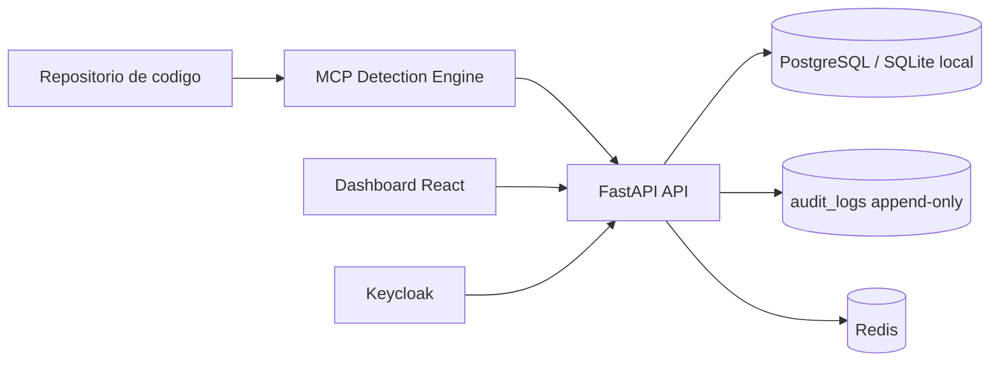
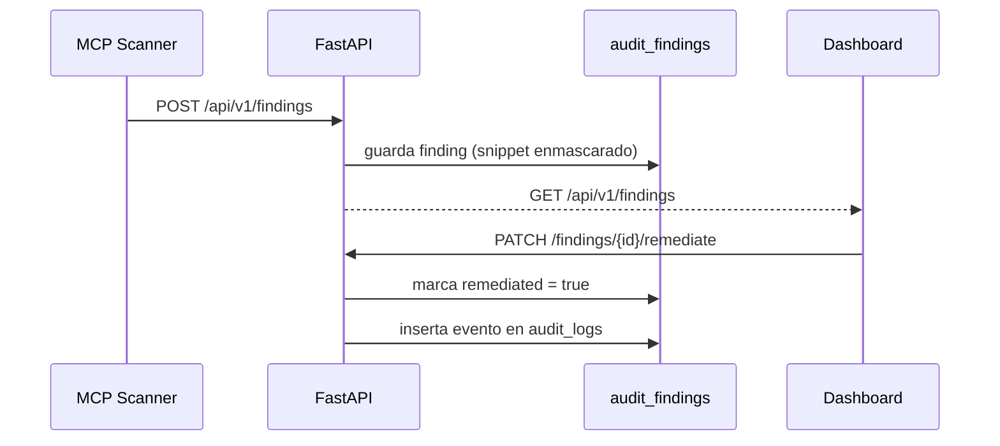

# BankGuard

Plataforma para deteccion de datos sensibles en codigo con:
- motor MCP (`mcp-server/`)
- API de seguridad (`api/`)
- dashboard operacional (`dashboard/`)
- infraestructura local (`infra/`)

## Arquitectura



## Flujo de hallazgos



## Estructura del repositorio

```text
bankguard/
├─ api/          # Backend FastAPI + SQLAlchemy async
├─ dashboard/    # React + Vite + TypeScript + Tailwind
├─ mcp-server/   # Motor de deteccion MCP
└─ infra/        # Docker Compose + servicios base
```

## Requisitos

- Node.js 18+
- Python 3.11+
- Docker Desktop (opcional para stack completo)

## Inicio rapido

### Opcion 1: stack completo con Docker

```bash
cp infra/.env.example infra/.env
cp api/.env.example api/.env
cd infra
docker compose up --build
```

Servicios:
- Dashboard: `http://localhost:3000`
- API docs: `http://localhost:8000/docs`
- Health: `http://localhost:8000/api/v1/health`
- Keycloak: `http://localhost:8080`

### Opcion 2: desarrollo local (sin Docker)

Backend:

```bash
cd api
python -m venv .venv
.venv/Scripts/activate
pip install -r requirements.txt
uvicorn app.main:app --reload --port 8000
```

Frontend:

```bash
cd dashboard
npm install
npm run dev
```

Dashboard local: `http://localhost:5173`

## Categorias y severidad

Categorias detectadas:
- `payment_card`
- `pii`
- `financial`
- `credentials`
- `health`

Umbrales de severidad:
- `critical`: >= 0.85
- `high`: >= 0.65
- `medium`: >= 0.40
- `low`: < 0.40

## Seguridad y cumplimiento

- No almacenar datos sensibles reales en logs ni DB.
- Guardar solo snippets enmascarados.
- Registrar acciones en `audit_logs`.
- Tratar `audit_logs` como append-only.
